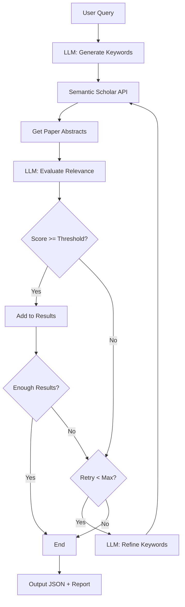

# Paper Search Agent v0.1

Agentic AI system for automatically finding relevant academic papers from Semantic Scholar. The purpose of this system is to quickly identify the target papers with user prompt.

An example prompt for the search is: enzyme kinetics with new formulas or algorithms in biochemistry, not with deep learning or molecular dynamics, published after 2025-08-31. With the this prompt, the llm will create the search keywords, and send the query to Semantic Scholar for a list of papers. The agent will send the abstracts to llm for further analysis to identify the papers matched with the prompt. If the matched paper is not enough, the agent will request the llm to change keywords and query again. 

The system has only been tested with groq/llama-3.1-8b-instant as the llm, since it supports 14.4 K requests per day without a charge.

## First-Time Setup

### 1. Create Virtual Environment (Recommended)

```bash
# Navigate to project directory
cd /PATH/TO/DIR

# Create virtual environment
python -m venv venv

# Activate virtual environment
# Linux/Mac:
source venv/bin/activate
# Windows:
venv\Scripts\activate
```

### 2. Install Dependencies

```bash
pip install -r requirements.txt
```

### 3. Configure API Key

Choose one LLM provider from the following:

| Provider | Sign Up | Environment Variable |
|----------|---------|----------------------|
| Groq (free) | https://console.groq.com/ | `GROQ_API_KEY` |
| OpenAI | https://platform.openai.com/ | `OPENAI_API_KEY` |
| Anthropic | https://www.anthropic.com/ | `ANTHROPIC_API_KEY` |
| OpenRouter | https://openrouter.ai/ | `OPENROUTER_API_KEY` |

Edit `.env` file:

```bash
# Copy example config
cp .env.example .env

# Edit .env file and add your API key
# For example, using Groq:
GROQ_API_KEY=your_api_key_here
```

### 4. Run Web UI

```bash
streamlit run webapp.py
```

Then open http://localhost:8501 in your browser.

---

## Quick Start (Already Configured)

If you already have your environment set up:

```bash
streamlit run webapp.py
```

Or use command line:

```bash
python main.py
```

## Project Structure

```
├── agents.py                    # LLM wrappers (keyword generation, paper evaluation)
├── config.py                    # Configuration (API keys, settings)
├── main.py                      # Main agent logic
├── models.py                    # Data models
├── semantic_scholar_client.py   # Semantic Scholar API client
├── webapp.py                    # Streamlit Web UI
├── prompts/
│   └── prompt.md               # Keyword extraction prompt template
├── queries/                     # Saved query records
├── results/                     # Search results (JSON + Markdown)
├── .env                         # API keys (do not commit to version control)
└── .streamlit/
    └── config.toml              # Streamlit configuration
```

## Architecture

```
User Query → Keyword Generation (Groq LLM)
          → Semantic Scholar API Search
          → Date Filter (skip papers published before min_date)
          → Abstract Evaluation (Groq LLM)
          → Relevance Filter
          → Results Output (JSON + Report)
```

## Agent Workflow



### Agent Principle

1. **Keyword Generation**: LLM analyzes user query and extracts key academic terms for optimized search keywords
2. **Paper Search**: Calls Semantic Scholar API to retrieve relevant paper list
3. **Date Filter**: Skip papers published before the user's specified min_date (if provided)
4. **Relevance Evaluation**: LLM analyzes paper title and abstract, gives a relevance score (0-10)
5. **Keyword Refinement**: If results are insufficient, LLM retries with simpler/different keywords
6. **Output**: Matching papers are saved as JSON and Markdown reports

## Output Files

Search results are saved to:
- `results/results_{timestamp}.json` - Structured JSON
- `results/results_{timestamp}.md` - Human-readable report
- `queries/query_{timestamp}.md` - Query details

## Notes

- Semantic Scholar API (free tier): ~0.5 requests/second
- If you hit rate limits, add your API key for higher limits
- Web UI runs on localhost only (not accessible externally)
